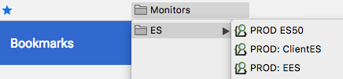

## Synopsis

Chrome Extension containing the excellent [ElasticSearch Head](https://github.com/mobz/elasticsearch-head) application.

## Motivation

This was created because ElasticSearch 5 removed the ability to run ElasticSearch Head as an Elastic Plugin.  This offers an alternative to self-hosting in your own web server.  It also has the advantage of bypassing CORS without configuring CORS on your Elastic server.

## Installation

Head over to [ElasticSearch Head](https://chrome.google.com/webstore/detail/elasticsearch-head/ffmkiejjmecolpfloofpjologoblkegm) page on the Chrome Web Store.

## Usage

1. Click the extension icon in the toolbar of your web browser.
2. Type the address for your elastic node into the top of the new tab that opened.
3. Click the Connect button.

## Usage tips

To make this more convenient to use (ie: without having to enter in the remote ElasticSearch URL each time), it's helpful to know that you can decorate the URL to the plugin, and use a bookmark on your bookmark bar to use in the future.

* If your ElasticSearch server is local, you can use
`chrome-extension://ffmkiejjmecolpfloofpjologoblkegm/elasticsearch-head/index.html?base_uri=http://localhost:9200`
* If your ElasticSearch server is remote and you have to use a SSH tunnel through a jump host:
	* setup your tunnel (in my example, port 29200)
	  `ssh -N -L 29200:myeshost:9200 myusername@jumphost`
	* then use `chrome-extension://ffmkiejjmecolpfloofpjologoblkegm/elasticsearch-head/index.html?base_uri=http://localhost:29200` to get to the remote ES cluster.

* If you have multiple remote ES clusters that you often connect to, making a folder in your bookmark bar, and then having each ES cluster can look pretty snazzy:
 

## Contact
[@hamburger_menu](https://twitter.com/hamburger_menu)
